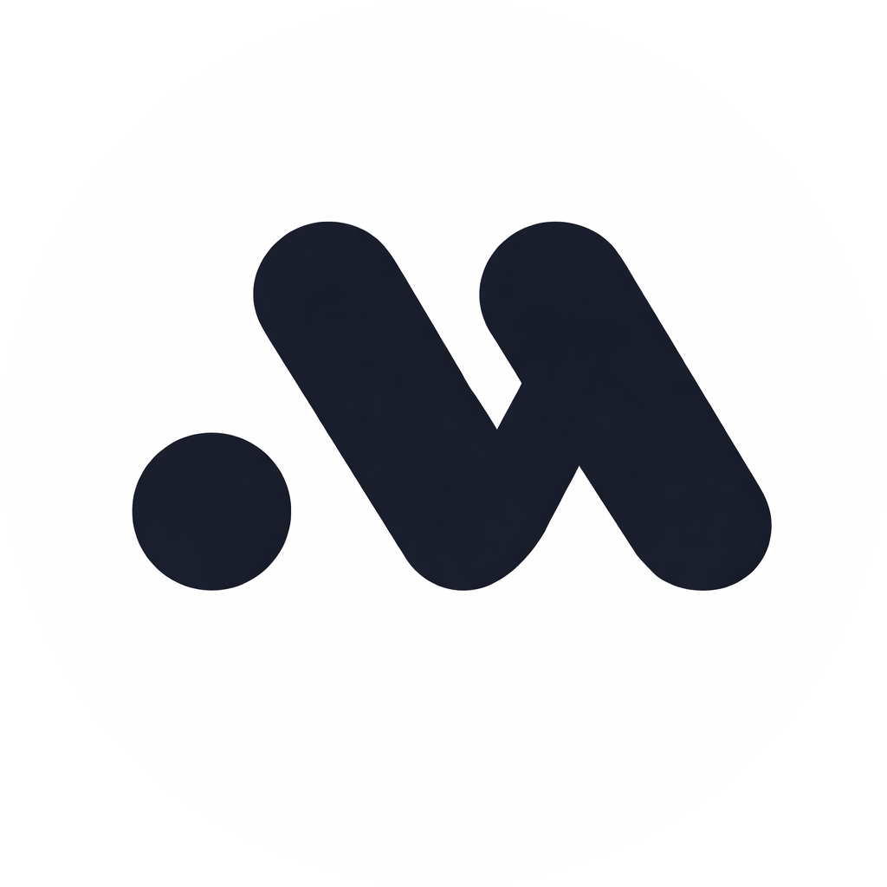
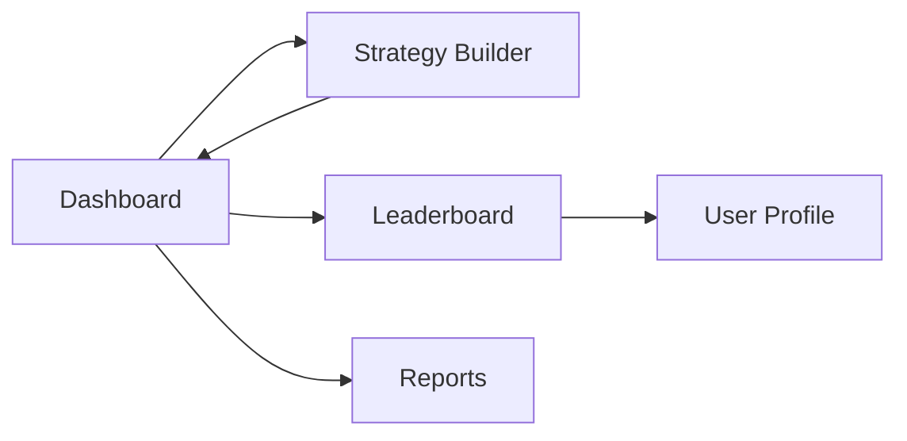

<div align="center">
  

  # Malgist

  ### 🚀 Intelligent DeFi Portfolio Management Platform

  [](https://nextjs.org/)
  [](https://www.typescriptlang.org/)
  [](https://tailwindcss.com/)
  [](https://reactjs.org/)
  [](https://wagmi.sh/)
  [](LICENSE)

  **Maximize your DeFi yields with AI-powered portfolio optimization**

  [Live Demo](#) • [Documentation](#) • [Report Bug](#) • [Request Feature](#)

  ---

  <br>

  <div align="center">
    <table>
      <tr>
        <td align="center">
          
          <br>
          <sub>Integrated Protocols</sub>
        </td>
        <td align="center">
          
          <br>
          <sub>Supported Networks</sub>
        </td>
        <td align="center">
          
          <br>
          <sub>Development Status</sub>
        </td>
      </tr>
    </table>
  </div>

</div>

---

## 📋 Table of Contents

- [✨ Overview](#-overview)
  - [Demo](#-demo)
  - [Why Malgist?](#-why-malgist)
  - [Key Features](#-key-features)
- [🚀 Quick Start](#-quick-start)
  - [Prerequisites](#prerequisites)
  - [Installation](#installation)
  - [Video Tutorial](#-video-tutorial)
- [🏗️ Tech Stack](#-tech-stack)
- [📁 Project Structure](#-project-structure)
- [📄 Page Structure & Routes](#-page-structure--routes)
- [💡 Core Features](#-core-features)
- [🔧 Development](#-development)
  - [Available Scripts](#available-scripts)
  - [Code Quality](#code-quality)
  - [Performance Optimization](#performance-optimization)
  - [Deployment](#deployment)
- [🌐 Supported Protocols](#-supported-protocols)
- [🔐 Security](#-security)
- [🗺️ Roadmap](#-roadmap)
- [❓ FAQ](#-faq)
- [🔧 Troubleshooting](#-troubleshooting)
- [🤝 Contributing](#-contributing)
- [📝 License](#-license)
- [📞 Support & Community](#-support--community)

---

## ✨ Overview

**Malgist** is a cutting-edge DeFi portfolio management platform that leverages artificial intelligence to help users optimize their cryptocurrency investments across multiple protocols. Built on Web3 technology, Malgist provides intelligent strategy recommendations, real-time portfolio tracking, and seamless interaction with leading DeFi protocols.

### 🎬 Demo

<div align="center">
  
  <p><em>Portfolio Dashboard - Monitor all your DeFi positions in real-time</em></p>
</div>

<div align="center">
  
  <p><em>AI Strategy Builder - Create optimized investment strategies with drag & drop</em></p>
</div>

### 💎 Why Malgist?

<table>
  <tr>
    <td width="33%" align="center">
      <h4>🎯 Smart Automation</h4>
      <p>Let AI handle the complexity of DeFi portfolio management. Get personalized strategies based on your risk profile and investment goals.</p>
    </td>
    <td width="33%" align="center">
      <h4>📊 Unified Dashboard</h4>
      <p>Track all your DeFi positions across multiple protocols in one beautiful interface. No more juggling between different platforms.</p>
    </td>
    <td width="33%" align="center">
      <h4>🔒 Fully Secure</h4>
      <p>Non-custodial and open-source. You maintain complete control of your assets with battle-tested smart contracts.</p>
    </td>
  </tr>
</table>

### 🎯 Key Features

<table>
  <tr>
    <td>
      <strong>🤖 AI-Powered Strategy Builder</strong><br>
      Get personalized investment strategies based on your risk tolerance and goals
    </td>
    <td>
      <strong>📊 Real-Time Portfolio Analytics</strong><br>
      Track your positions, earnings, and performance across multiple protocols
    </td>
  </tr>
  <tr>
    <td>
      <strong>🔄 Automated Rebalancing</strong><br>
      Keep your portfolio optimized with smart rebalancing recommendations
    </td>
    <td>
      <strong>🏆 Community Leaderboard</strong><br>
      Compare strategies and learn from top performers
    </td>
  </tr>
  <tr>
    <td>
      <strong>📈 Multi-Protocol Support</strong><br>
      Integrate with Aave, Lido, Compound, Yearn, and Convex
    </td>
    <td>
      <strong>🔐 Non-Custodial & Secure</strong><br>
      Your keys, your crypto - full control over your assets
    </td>
  </tr>
  <tr>
    <td>
      <strong>📱 Responsive Design</strong><br>
      Beautiful interface that works on all devices
    </td>
    <td>
      <strong>⚡ Gas Optimization</strong><br>
      Smart transaction batching to minimize gas fees
    </td>
  </tr>
</table>

---

## 🚀 Quick Start

### Prerequisites

- Node.js 20.x or higher
- npm, yarn, pnpm, or bun
- A Web3 wallet (MetaMask, WalletConnect, etc.)

### Installation

1. **Clone the repository**
   ```bash
   git clone https://github.com/yourusername/malgist-app.git
   cd malgist-app
   ```

2. **Install dependencies**
   ```bash
   npm install
   # or
   yarn install
   # or
   pnpm install
   ```

3. **Set up environment variables**
   ```bash
   cp .env.example .env.local
   ```

   Edit `.env.local` and configure the following:
   ```env
   # Wallet Connect Project ID (get from https://cloud.walletconnect.com)
   NEXT_PUBLIC_WALLET_CONNECT_PROJECT_ID=your_project_id_here

   # RPC URLs (optional - uses public RPCs by default)
   NEXT_PUBLIC_ETHEREUM_RPC_URL=your_rpc_url_here

   # Analytics (optional)
   NEXT_PUBLIC_ANALYTICS_ID=your_analytics_id_here
   ```

4. **Run the development server**
   ```bash
   npm run dev
   # or
   yarn dev
   # or
   pnpm dev
   ```

5. **Open your browser**

   Navigate to [http://localhost:3000](http://localhost:3000) to see the application.

### 🎥 Video Tutorial

<div align="center">
  <a href="#">
    
  </a>
  <p><em>Watch our 5-minute getting started guide (Coming soon)</em></p>
</div>

---

## 🏗️ Tech Stack

### Frontend
- **Framework**: [Next.js 16](https://nextjs.org/) - React framework with App Router
- **Language**: [TypeScript](https://www.typescriptlang.org/) - Type-safe development
- **Styling**: [Tailwind CSS 4](https://tailwindcss.com/) - Utility-first CSS framework
- **UI Components**:
  - [Radix UI](https://www.radix-ui.com/) - Accessible component primitives
  - [Lucide React](https://lucide.dev/) - Beautiful icon library
- **Animations**: [Framer Motion](https://www.framer.com/motion/) - Production-ready motion library
- **Charts**: [Recharts](https://recharts.org/) - Composable charting library

### Web3 Integration
- **Wallet Connection**: [RainbowKit](https://www.rainbowkit.com/) - Best-in-class wallet connection
- **Web3 Library**: [Wagmi](https://wagmi.sh/) - React Hooks for Ethereum
- **Ethereum Client**: [Viem](https://viem.sh/) - TypeScript interface for Ethereum
- **Provider**: [Ethers.js](https://docs.ethers.org/) - Ethereum library

### State Management & Data
- **Data Fetching**: [TanStack Query](https://tanstack.com/query) - Powerful async state management
- **Drag & Drop**: [dnd-kit](https://dndkit.com/) - Modern drag and drop toolkit

---

## 📁 Project Structure

```
malgist-app/
├── app/                          # Next.js App Router
│   ├── layout.tsx               # Root layout
│   ├── page.tsx                 # Dashboard/Portfolio page
│   ├── strategy/                # Strategy builder
│   ├── leaderboard/            # Community leaderboard
│   ├── profile/                # User profiles
│   └── reports/                # Monthly reports
├── components/                  # React components
│   ├── layout/                 # Layout components
│   │   ├── DashboardLayout.tsx
│   │   └── Sidebar.tsx
│   ├── portfolio/              # Portfolio management
│   │   ├── DepositModal.tsx
│   │   ├── WithdrawModal.tsx
│   │   ├── RebalanceModal.tsx
│   │   └── PositionCard.tsx
│   ├── strategy/               # Strategy builder components
│   │   ├── AIQuestionnaireModal.tsx
│   │   ├── StrategyCanvas.tsx
│   │   ├── ProtocolLibrary.tsx
│   │   └── AllocationCard.tsx
│   ├── leaderboard/            # Leaderboard components
│   ├── wallet/                 # Web3 wallet components
│   └── providers/              # React context providers
├── lib/                         # Utilities and configurations
│   ├── wagmi.ts                # Wagmi configuration
│   └── avatar.ts               # Avatar generation
├── types/                       # TypeScript type definitions
│   └── index.ts
├── public/                      # Static assets
└── package.json                # Project dependencies
```

---

## 📄 Page Structure & Routes

Malgist menggunakan Next.js App Router untuk routing yang modern dan efisien. Berikut adalah struktur halaman dan route dalam aplikasi:

### Main Routes

| Route | File Location | Deskripsi |
|-------|--------------|-----------|
| `/` | [app/page.tsx](app/page.tsx) | **Dashboard/Portfolio** - Halaman utama untuk monitoring portfolio DeFi, menampilkan total balance, positions, dan quick actions |
| `/strategy` | [app/strategy/page.tsx](app/strategy/page.tsx) | **Strategy Builder** - Halaman untuk membuat dan mengelola strategi investasi dengan AI-powered recommendations dan drag-and-drop interface |
| `/leaderboard` | [app/leaderboard/page.tsx](app/leaderboard/page.tsx) | **Community Leaderboard** - Ranking dan perbandingan performa strategi dari berbagai pengguna |
| `/profile/[address]` | [app/profile/[address]/page.tsx](app/profile/[address]/page.tsx) | **User Profile** - Profil detail pengguna berdasarkan wallet address, menampilkan strategi dan performa historis |
| `/reports` | [app/reports/page.tsx](app/reports/page.tsx) | **Monthly Reports** - Laporan bulanan lengkap tentang performa portfolio dan analisis yield |

### Layouts

| Layout | File Location | Scope | Deskripsi |
|--------|--------------|-------|-----------|
| Root Layout | [app/layout.tsx](app/layout.tsx) | Semua halaman | Layout utama yang berisi Web3Provider, font configuration, dan metadata global |
| Dashboard Layout | [app/(dashboard)/layout.tsx](app/(dashboard)/layout.tsx) | Dashboard pages | Layout khusus untuk halaman dashboard dengan Sidebar navigation |

### Route Groups

Aplikasi menggunakan **route groups** dengan konvensi `(dashboard)` untuk mengorganisir halaman yang memiliki layout yang sama tanpa mempengaruhi URL path.

```
app/
├── (dashboard)/              # Route group - tidak muncul di URL
│   └── layout.tsx           # Shared layout untuk dashboard pages
├── layout.tsx               # Root layout (semua pages)
├── page.tsx                 # "/" - Dashboard/Portfolio
├── strategy/
│   └── page.tsx            # "/strategy" - Strategy Builder
├── leaderboard/
│   └── page.tsx            # "/leaderboard" - Leaderboard
├── profile/
│   └── [address]/
│       └── page.tsx        # "/profile/:address" - User Profile
└── reports/
    └── page.tsx            # "/reports" - Monthly Reports
```

### Dynamic Routes

**Profile Page** menggunakan dynamic routing:
- Pattern: `/profile/[address]`
- Contoh: `/profile/0x742d35Cc6634C0532925a3b844Bc9e7595f0bEb`
- Parameter `address` adalah wallet address pengguna

### Navigation Flow



**User Journey:**
1. **Landing** → Dashboard (`/`) - Lihat portfolio overview
2. **Create Strategy** → Strategy Builder (`/strategy`) - Buat strategi baru dengan AI
3. **Compare Performance** → Leaderboard (`/leaderboard`) - Bandingkan dengan user lain
4. **View Details** → User Profile (`/profile/[address]`) - Lihat detail strategi user
5. **Track Progress** → Reports (`/reports`) - Analisis performa bulanan

### Key Features per Page

<details>
<summary><strong>📊 Dashboard (/) </strong></summary>

**Features:**
- Total portfolio value (TVL)
- Asset allocation breakdown
- Active positions per protocol
- Quick actions: Deposit, Withdraw, Rebalance
- Performance charts (24h, 7d, 30d)
- Recent transactions

**Components Used:**
- `PortfolioSummary`
- `PositionCard`
- `DepositModal`
- `WithdrawModal`
- `RebalanceModal`
</details>

<details>
<summary><strong>🎯 Strategy Builder (/strategy)</strong></summary>

**Features:**
- AI questionnaire untuk risk assessment
- Drag-and-drop protocol allocation
- Real-time APY calculations
- Visual strategy canvas
- Protocol library dengan detail
- Strategy optimization suggestions

**Components Used:**
- `AIQuestionnaireModal`
- `StrategyCanvas`
- `ProtocolLibrary`
- `AllocationCard`
- `PortfolioSummary`
</details>

<details>
<summary><strong>🏆 Leaderboard (/leaderboard)</strong></summary>

**Features:**
- Top performers ranking
- Strategy performance metrics (APY, TVL, ROI)
- Filter by timeframe (24h, 7d, 30d, All)
- Strategy detail view
- Copy strategy functionality
- User avatars dan badges

**Components Used:**
- `LeaderboardTable`
- `StrategyDetailModal`
- `UserAvatar`
- `PerformanceChart`
</details>

<details>
<summary><strong>👤 User Profile (/profile/[address])</strong></summary>

**Features:**
- User avatar dan wallet address
- Total portfolio value
- Active strategies list
- Historical performance
- Strategy breakdown
- Earned rewards summary

**Components Used:**
- `AvatarSelector`
- `ProfileHeader`
- `StrategyList`
- `PerformanceTimeline`
</details>

<details>
<summary><strong>📈 Reports (/reports)</strong></summary>

**Features:**
- Monthly performance summary
- Protocol-wise earnings breakdown
- Risk-adjusted returns analysis
- Comparison with previous months
- Downloadable PDF reports
- Interactive charts

**Components Used:**
- `MonthlyReport`
- `EarningsBreakdown`
- `PerformanceChart`
- `ReportDownloader`
</details>

### Shared Components

Semua halaman menggunakan shared components dari direktori `components/`:

- **Layout**: `Sidebar`, `DashboardLayout`
- **Providers**: `Web3Provider` (Wagmi + RainbowKit)
- **UI Components**: Buttons, Modals, Cards, Charts
- **Wallet Integration**: Connect wallet, account display, network switcher

---

## 💡 Core Features

### 1. Portfolio Dashboard
Monitor all your DeFi positions in one place:
- Real-time balance tracking across protocols
- Total value locked (TVL) and APY calculations
- Historical performance charts
- Quick deposit, withdraw, and rebalance actions

### 2. AI Strategy Builder
Create optimized investment strategies:
- Answer a few questions about your goals
- Get AI-powered allocation recommendations
- Customize protocols and percentages with drag-and-drop
- Visual strategy canvas with real-time analytics

### 3. Smart Rebalancing
Keep your portfolio optimized:
- Automated rebalancing suggestions
- Visual comparison of current vs. target allocations
- Gas-efficient execution strategies
- Historical rebalancing performance

### 4. Community Leaderboard
Learn from the best:
- Top-performing strategies ranked by performance
- Detailed strategy breakdowns
- Follow and copy successful allocations
- User profiles with strategy history

### 5. Monthly Reports
Track your progress:
- Comprehensive monthly performance summaries
- Protocol-wise earnings breakdown
- Risk-adjusted returns analysis
- Downloadable PDF reports

---

## 🔧 Development

### Available Scripts

```bash
# Start development server
npm run dev

# Build for production
npm run build

# Start production server
npm run start

# Run linter
npm run lint
```

### Code Quality

This project follows modern React and TypeScript best practices:
- ✅ Functional components with hooks
- ✅ TypeScript strict mode enabled
- ✅ ESLint for code quality
- ✅ Organized component structure
- ✅ Responsive design patterns
- ✅ Modular and reusable components

### Environment Variables

Create a `.env.local` file in the root directory:

```env
# Required
NEXT_PUBLIC_WALLET_CONNECT_PROJECT_ID=your_project_id

# Optional
NEXT_PUBLIC_ETHEREUM_RPC_URL=https://eth-mainnet.g.alchemy.com/v2/your-key
NEXT_PUBLIC_ENABLE_ANALYTICS=true
```

### Performance Optimization

Malgist is optimized for performance:

- ⚡ **Fast Loading**: Next.js 16 with App Router for optimal performance
- 🎯 **Code Splitting**: Automatic route-based code splitting
- 📦 **Bundle Size**: Tree-shaking and optimized builds
- 🖼️ **Image Optimization**: Next.js Image component for optimized assets
- 💾 **Caching**: Smart caching with TanStack Query
- 🔄 **SSR/SSG**: Server-side rendering and static generation where applicable

### Project Configuration

Key configuration files:
- `next.config.js` - Next.js configuration
- `tailwind.config.ts` - Tailwind CSS configuration
- `tsconfig.json` - TypeScript configuration
- `lib/wagmi.ts` - Web3 wallet configuration

### Deployment

Malgist can be deployed to various platforms:

#### Vercel (Recommended)

[](https://vercel.com/new/clone?repository-url=https://github.com/yourusername/malgist-app)

1. Click the deploy button above
2. Configure environment variables in Vercel dashboard
3. Deploy!

#### Other Platforms

- **Netlify**: Connect your GitHub repo and deploy
- **AWS Amplify**: Use the AWS Console to deploy
- **Self-hosted**: Build with `npm run build` and serve the `.next` folder

**Important**: Make sure to set all required environment variables in your deployment platform's settings.

---

## 🌐 Supported Protocols

Malgist currently integrates with leading DeFi protocols:

| Protocol | Type | Networks |
|----------|------|----------|
| **Aave V3** | Lending | Ethereum, Polygon, Arbitrum |
| **Lido** | Staking | Ethereum |
| **Compound V3** | Lending | Ethereum, Base |
| **Yearn Finance** | Yield Aggregator | Ethereum |
| **Convex Finance** | Yield Optimizer | Ethereum |

*More protocols coming soon!*

---

## 🔐 Security

Security is our top priority. Here's how we protect your assets:

- **🔒 Non-custodial**: You always maintain full control of your funds through your own wallet
- **✅ Audited contracts**: All integrated protocols are battle-tested and audited by leading security firms
- **🔑 No private key storage**: Wallet connection via secure Web3 providers only (RainbowKit, WalletConnect)
- **📖 Open source**: Transparent codebase available for community review and audit
- **🛡️ Best practices**: Following OWASP security guidelines and smart contract safety standards

### Security Best Practices

1. **Always verify contract addresses** before approving transactions
2. **Start small** when trying new strategies
3. **Use hardware wallets** for large amounts
4. **Keep your seed phrase secure** and never share it
5. **Stay updated** on protocol audits and security announcements

> ⚠️ **Disclaimer**: DeFi involves risks. Never invest more than you can afford to lose. Always do your own research (DYOR).

---

## 🗺️ Roadmap

### Q1 2025 - Foundation ✅
- [x] Core portfolio tracking functionality
- [x] AI-powered strategy builder
- [x] Multi-protocol integration (Aave, Lido, Compound)
- [x] Community leaderboard
- [x] Responsive web interface

### Q2 2025 - Enhancement
- [ ] Mobile app (iOS & Android)
- [ ] Advanced analytics & risk metrics
- [ ] Automated portfolio rebalancing
- [ ] Gas optimization features
- [ ] Multi-chain support (Arbitrum, Optimism, Base)

### Q3 2025 - Expansion
- [ ] Social trading features
- [ ] Strategy marketplace
- [ ] Yield farming aggregator
- [ ] Advanced DeFi strategies (leverage, delta-neutral)
- [ ] Portfolio backtesting

### Q4 2025 - Innovation
- [ ] AI-powered risk assessment
- [ ] Cross-chain portfolio management
- [ ] NFT-gated premium features
- [ ] Integration with more protocols
- [ ] API for third-party developers

---

## ❓ FAQ

<details>
<summary><strong>Is Malgist free to use?</strong></summary>
<br>
Yes! Malgist is completely free to use. You only pay standard blockchain gas fees when executing transactions on the network.
</details>

<details>
<summary><strong>Do you take custody of my funds?</strong></summary>
<br>
No, never. Malgist is 100% non-custodial. Your funds always remain in your wallet, and you maintain complete control. We only facilitate interactions with DeFi protocols.
</details>

<details>
<summary><strong>Which wallets are supported?</strong></summary>
<br>
We support all major Web3 wallets including MetaMask, WalletConnect, Coinbase Wallet, Rainbow, Ledger, and more through RainbowKit integration.
</details>

<details>
<summary><strong>Which blockchains does Malgist support?</strong></summary>
<br>
Currently, we support Ethereum mainnet, with plans to expand to Polygon, Arbitrum, Optimism, and Base in Q2 2025.
</details>

<details>
<summary><strong>How does the AI strategy builder work?</strong></summary>
<br>
Our AI analyzes your risk tolerance, investment goals, and market conditions to suggest optimal portfolio allocations across different DeFi protocols. You can customize and adjust these suggestions before implementing them.
</details>

<details>
<summary><strong>What are the risks of using DeFi protocols?</strong></summary>
<br>
DeFi carries several risks including smart contract vulnerabilities, impermanent loss, market volatility, and liquidation risks. Always research protocols, start with small amounts, and never invest more than you can afford to lose.
</details>

<details>
<summary><strong>Can I copy strategies from top performers?</strong></summary>
<br>
Yes! Our leaderboard allows you to view successful strategies and implement similar allocations in your own portfolio. However, past performance doesn't guarantee future results.
</details>

<details>
<summary><strong>How accurate are the APY/returns shown?</strong></summary>
<br>
APY rates are fetched in real-time from protocol APIs and on-chain data. However, rates are variable and can change based on market conditions, protocol utilization, and other factors.
</details>

---

## 🔧 Troubleshooting

### Common Issues

<details>
<summary><strong>Wallet won't connect</strong></summary>
<br>

1. Make sure you have a Web3 wallet extension installed (MetaMask, Rainbow, etc.)
2. Check that you're on the correct network (Ethereum Mainnet)
3. Clear your browser cache and try again
4. Disable any ad blockers that might interfere with wallet connections
5. Try a different wallet or browser

</details>

<details>
<summary><strong>Build fails or dependencies won't install</strong></summary>
<br>

1. Delete `node_modules` and `package-lock.json`
2. Clear npm cache: `npm cache clean --force`
3. Reinstall dependencies: `npm install`
4. Make sure you're using Node.js 20.x or higher: `node --version`
5. Try using a different package manager (yarn, pnpm)

</details>

<details>
<summary><strong>Environment variables not working</strong></summary>
<br>

1. Make sure your `.env.local` file is in the root directory
2. Restart the development server after changing environment variables
3. Verify that all required variables are set
4. Check that variable names start with `NEXT_PUBLIC_` for client-side access

</details>

<details>
<summary><strong>Transactions failing or stuck</strong></summary>
<br>

1. Check that you have enough ETH for gas fees
2. Verify you're on the correct network
3. Try increasing the gas limit or gas price
4. Wait for previous transactions to complete
5. Check your wallet's transaction history for any pending transactions

</details>

---

## 🤝 Contributing

We welcome contributions from the community! Whether you're fixing bugs, adding features, improving documentation, or suggesting new ideas, your help is appreciated.

### How to Contribute

1. **Fork the repository**
   ```bash
   git clone https://github.com/yourusername/malgist-app.git
   ```

2. **Create your feature branch**
   ```bash
   git checkout -b feature/AmazingFeature
   ```

3. **Make your changes**
   - Write clean, documented code
   - Follow the existing code style
   - Add tests if applicable

4. **Commit your changes**
   ```bash
   git commit -m 'Add some AmazingFeature'
   ```

5. **Push to the branch**
   ```bash
   git push origin feature/AmazingFeature
   ```

6. **Open a Pull Request**
   - Describe your changes in detail
   - Link any related issues
   - Wait for review from maintainers

### Contribution Guidelines

- 🐛 **Bug Reports**: Use the GitHub issue tracker to report bugs
- 💡 **Feature Requests**: Suggest new features through GitHub issues
- 📝 **Documentation**: Help improve our docs and README
- 🧪 **Testing**: Add or improve test coverage
- 🎨 **Design**: Contribute UI/UX improvements

For more details, please read [CONTRIBUTING.md](CONTRIBUTING.md) for our code of conduct and development process.

---

## 📝 License

This project is licensed under the MIT License - see the [LICENSE](LICENSE) file for details.

---

## 🙏 Acknowledgments

- Built with [Next.js](https://nextjs.org/)
- Wallet integration by [RainbowKit](https://www.rainbowkit.com/)
- UI components from [Radix UI](https://www.radix-ui.com/)
- Charts powered by [Recharts](https://recharts.org/)
- Icons by [Lucide](https://lucide.dev/)

---

## 📞 Support & Community

Need help or want to connect with other Malgist users?

<table>
  <tr>
    <td align="center">
      <a href="#">
        
      </a>
      <br>
      <sub>Read the Docs</sub>
    </td>
    <td align="center">
      <a href="#">
        
      </a>
      <br>
      <sub>Join our Discord</sub>
    </td>
    <td align="center">
      <a href="#">
        
      </a>
      <br>
      <sub>Follow us on Twitter</sub>
    </td>
    <td align="center">
      <a href="mailto:support@malgist.io">
        
      </a>
      <br>
      <sub>Email Support</sub>
    </td>
  </tr>
</table>

---

## ⭐ Show Your Support

If you find Malgist helpful, please consider:

- ⭐ **Star this repository** to show your support
- 🐦 **Share on Twitter** to spread the word
- 🤝 **Contribute** to the project
- 💬 **Join our community** and help others

---

## 🙏 Built With

This project wouldn't be possible without these amazing open-source projects:

<div align="center">

| Technology | Purpose |
|------------|---------|
| [Next.js](https://nextjs.org/) | React Framework |
| [RainbowKit](https://www.rainbowkit.com/) | Wallet Connection |
| [Wagmi](https://wagmi.sh/) | Web3 React Hooks |
| [Viem](https://viem.sh/) | Ethereum Interface |
| [Radix UI](https://www.radix-ui.com/) | UI Components |
| [Tailwind CSS](https://tailwindcss.com/) | Styling |
| [Recharts](https://recharts.org/) | Data Visualization |
| [Framer Motion](https://www.framer.com/motion/) | Animations |
| [TanStack Query](https://tanstack.com/query) | Data Fetching |

</div>

Special thanks to all the DeFi protocols we integrate with: Aave, Lido, Compound, Yearn Finance, and Convex Finance.

---

<div align="center">

  ### Made with 💙 by the Malgist Team

  **Building the future of DeFi portfolio management**

  [🌐 Website](#) • [🐦 Twitter](#) • [💬 Discord](#) • [📱 Telegram](#)

  <sub>© 2025 Malgist. All rights reserved.</sub>

</div>
